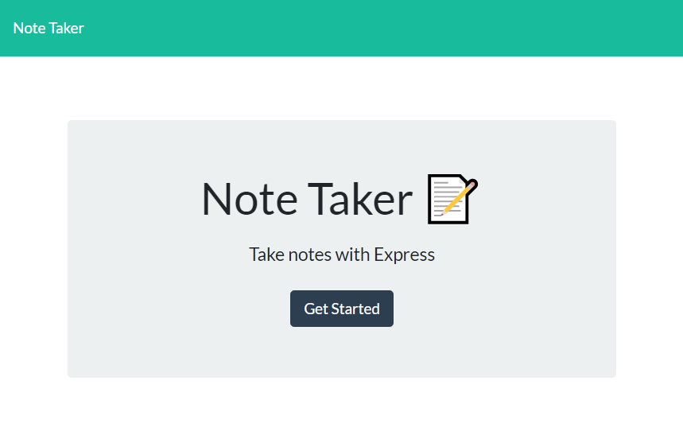
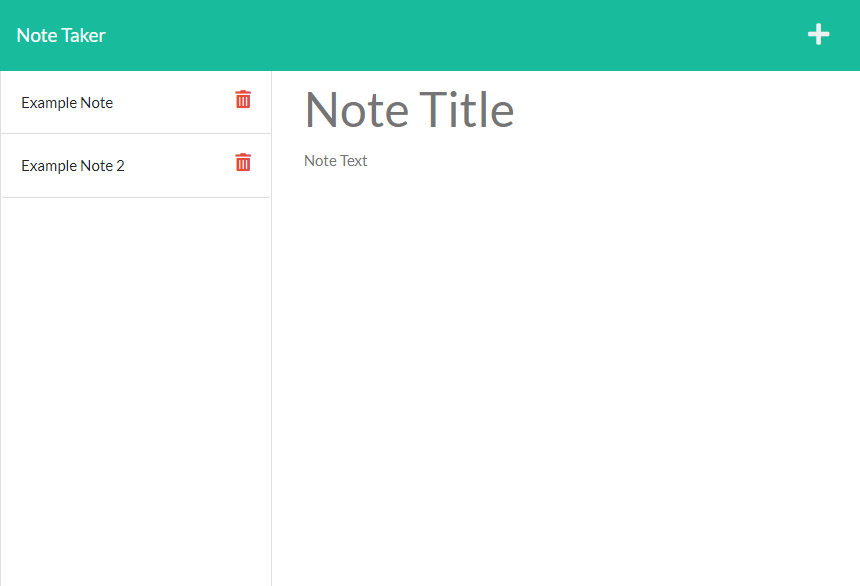

# [Note Taker App](https://github.com/apatheticjedi/note-taker-app)

### Table of Contents

1. [Description](#description)
2. [Built With](#built-with)
3. [Installation](#installation)
4. [Usage](#usage)
5. [Acknowledgments](#acknowledgments)
6. [Questions](#questions)

## Description

This is an application that uses Express.js to take notes input by the user and save them on a deployed server. 

[Heroku Link](https://powerful-basin-45669.herokuapp.com/)

### Built With

* JavaScript
* HTML
* CSS
* Bootstrap
* Node.js 

(<a href="#top">back to top</a>)

## Usage

Visit the [Note Taker App](https://powerful-basin-45669.herokuapp.com/) site deployed on Heroku. Click the "Get Started" button to open the notes page. There, you can enter a note title and text, then click the save icon to save the note to the list on the left. Click the trash icon on a listed note to delete it.

## Acknowledgments

* [uuid npm](https://www.npmjs.com/package/uuid)
* [Express.js npm](https://www.npmjs.com/package/express)
* [Font Awesome](https://fontawesome.com/)
* [Heroku](https://heroku.com/)

(<a href="#top">back to top</a>)

## Questions

Reach out to me with questions at:

[GitHub](https://github.com/apatheticjedi)

## License

[MIT License](https://spdx.org/licenses/MIT.html)

(<a href="#top">back to top</a>)

